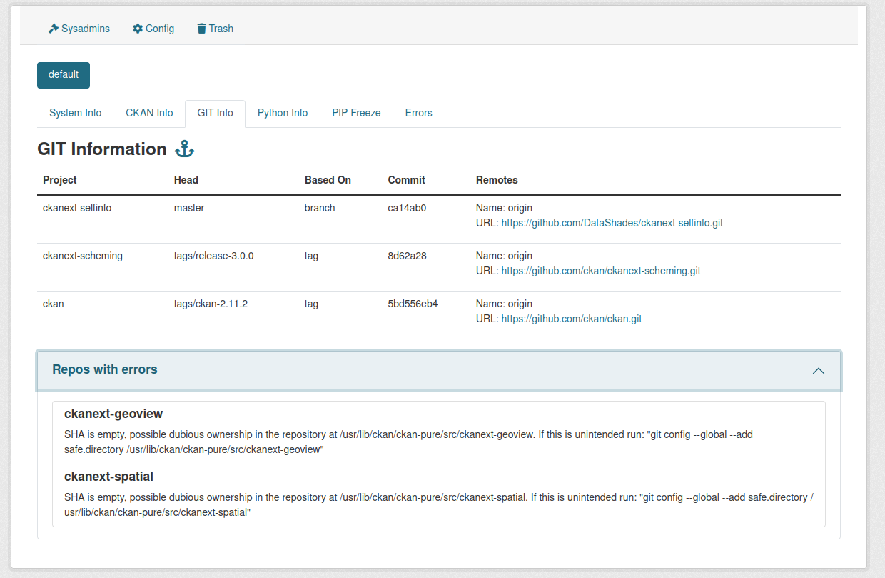

## Enable GIT Info

In order to enable GIT Info you need to add the `ckan.selfinfo.ckan_repos_path`, which is the path to your folder, where all extensions stored.

Keep in mind, that ownership for those folders should be accessible for the User that runs the CKAN APP, if not, on GIT Info tab under **Repos with errors**, errors will be shown regarding ownership.

Additionally you can specify using `ckan.selfinfo.ckan_repos`, which repos you want to track from this folder, as by default it will try to read all of them.