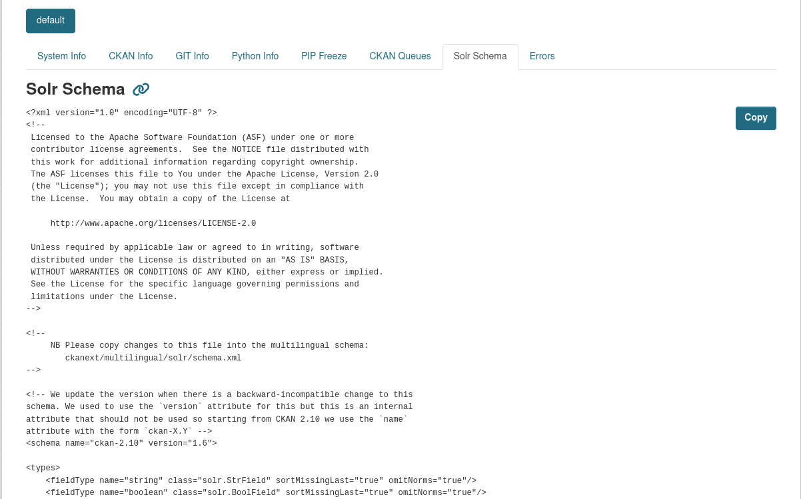

## Enable Solr Schema

In order to enable Solr Schema you need to add `ckan.selfinfo.solr_schema_filename`, which is the filename that Solr uses for your schema. In different Solr settings this file can be named `managed-schema` or `schema.xml`, you can find which one Solr is using in your Solr Core directory -> conf folder.

If `ckan.selfinfo.solr_schema_filename` is not set, the tab will be missing.
