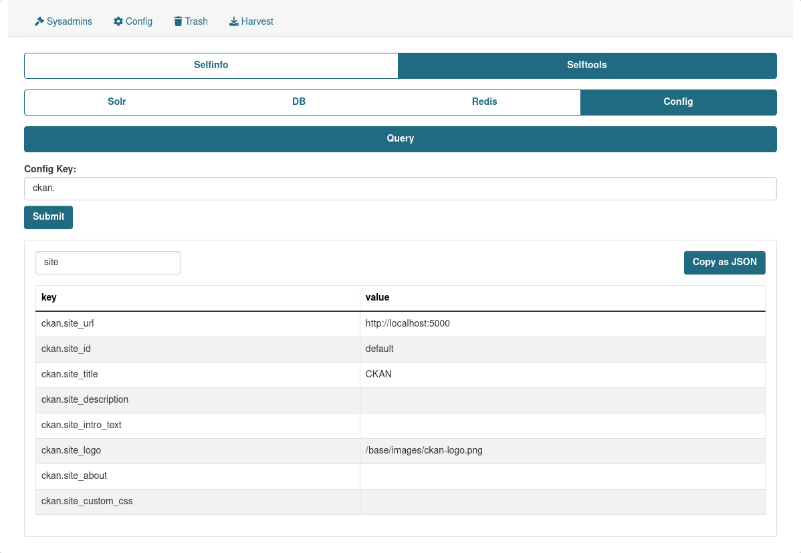

## Query

Provides an ability to check CKAN config params.

There is a functionality that allows to add CKAN Config params to blacklist, in order not to expose any critical infromation. Please check [Config Settings](../config_settings.md) -> `ckan.selftools.config_blacklist` param for more details.

