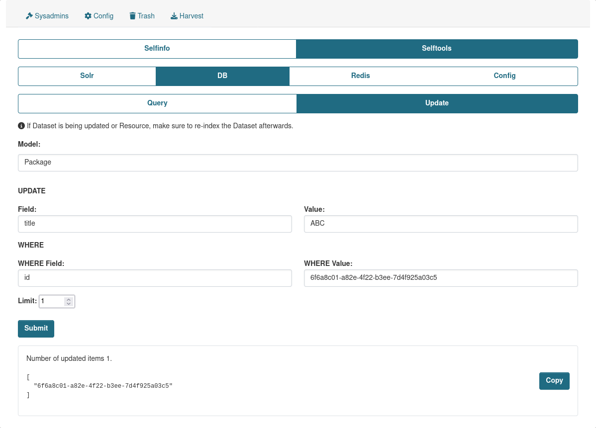

DB Category give you an ability to retrieve data from DB and update rows in it.

The Query and Update tools are based on predefined list of CKAN Models to select from.

There is a functionality that allows to extend the Models list and add your own Models to the List. You can find more details [here](../extending_selftools.md).

Also you can hide the actual values for specific fields that shown in the results, to make sure that they are not exposed. This can be done by adding `ckan.selftools.model_fields_blacklist`, for more details look [here](../config_settings.md).

## Query

Provides an ability to search in DB using registered Models in CKAN.

## Update

Provides an ability to update data within DB.

