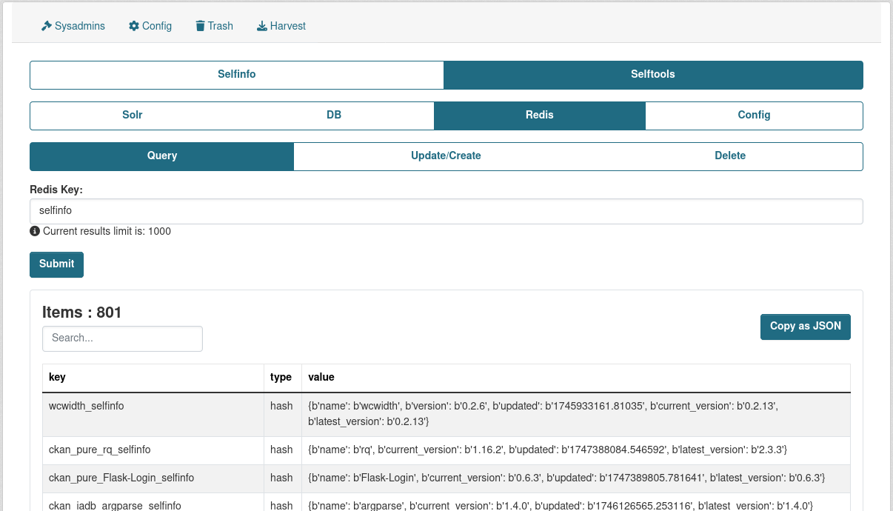
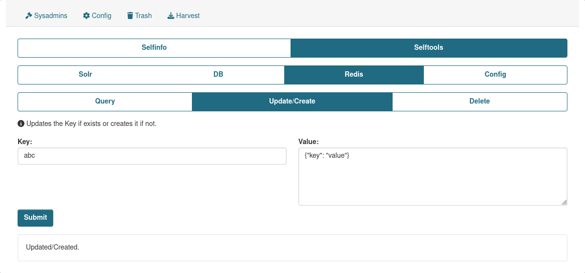
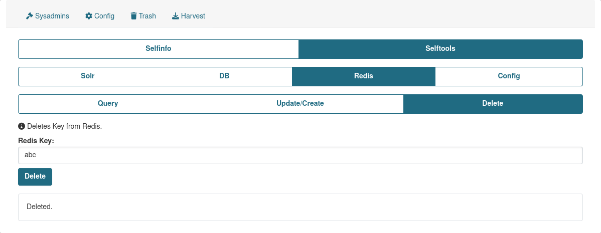

## Query

Provides an ability to serach through Redis using keys.

## Update/Create

Provides an ability to update/create Redis key/value.

## Delete

Provides an ability to delete key from Redis if exists.

