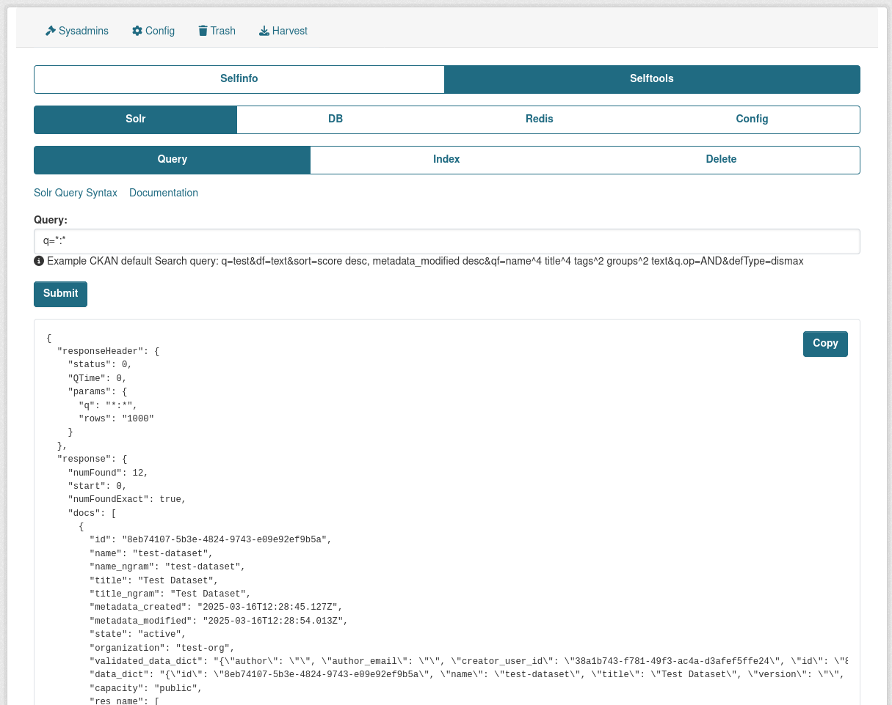
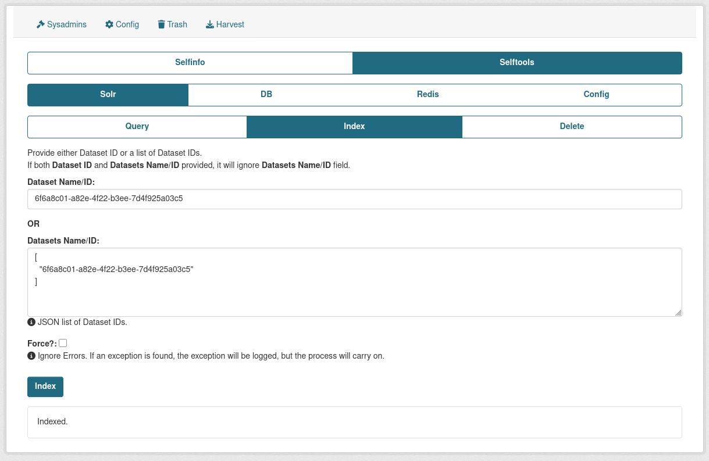
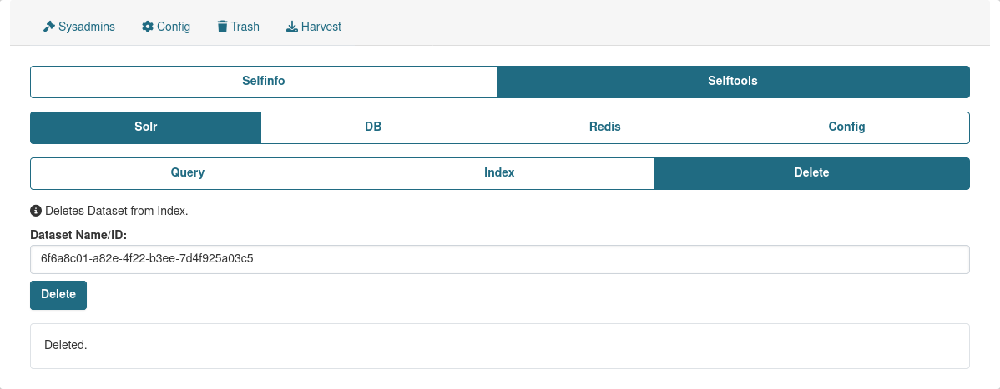

## Query

Provides an ability to make pure Solr queries and check on how the Dataset is being indexed in Solr.

## Index

Provides an ability index/re-index Datasets from UI. It can 1 Dataset or multiple Datasets.

## Delete

Provides an to delete Dataset from index.

